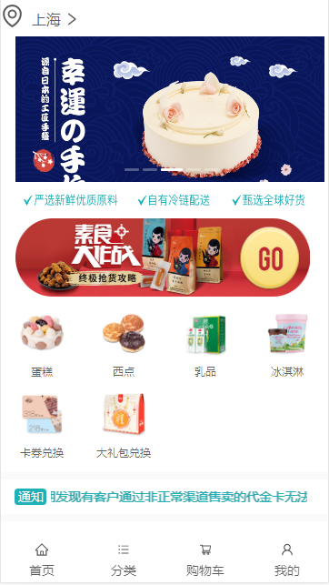
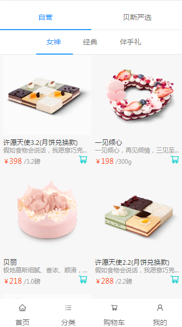
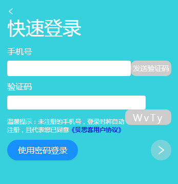
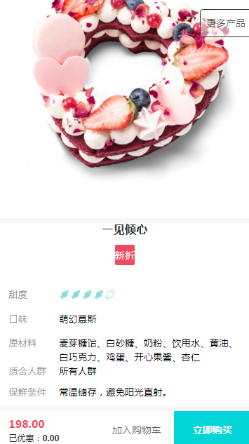
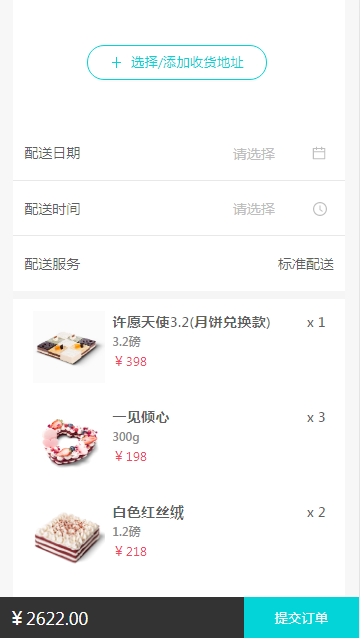
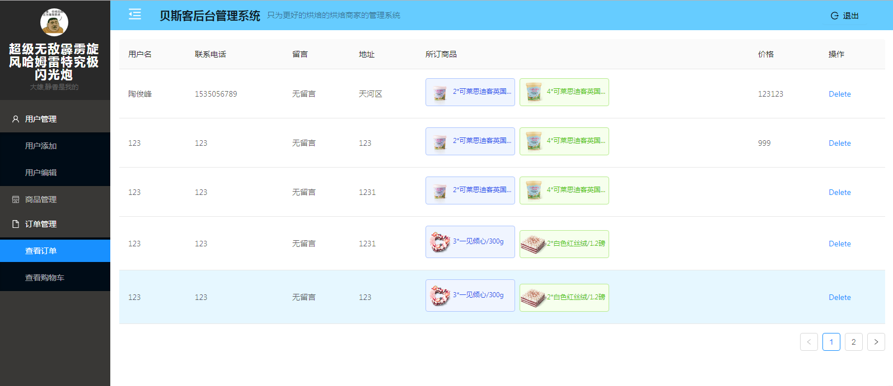

# BestCake
#### 贝思克烘焙 (BESTCAKE)

> bestcake是基于React框架的一款美食app ,项目包含后台管理系统 ;


#### 项目演示:

- 贝思克烘焙官网：<http://m.bestcake.com/>
- 上线地址：<http://47.98.245.185:20085/home>  后台：<http://47.98.245.185:30006>
- git仓库地址 ：https://github.com/gzh51907/BestCake.git

#### 团队与分工

###### 组长:罗宏鑫   组员: 李锦辉  陶俊峰

> 团队分工及模块分配由罗宏鑫组织完成；

##### 个人分工说明：

###### 陶俊峰:

-首页以及详情页面的完成;
-后台的用户,商品的相关页面及功能完成;
-所负责页面的数据接口;

###### 罗宏鑫:

- 列表页（添加到购物车将信息同时存本地、仓库、数据库）
- 订单页（订单页能记录详细信息，点击地址能跳到另一个组件去填写地址信息，还有其他蜡烛、餐具等商品添加、根据数据库或仓库渲染）
- 数据爬取
- 后端基础接口配置，即所负责的页面接口
- 后台管理系统登录页
- 后台管理系统公共样式
- 后台管理系统的购物车信息管理页
- 后台管理系统订单管理

###### 李锦辉:

- 购物车页（未登录前也能够浏览，获取存储在本地stroage的商品信息，发起请求渲染购物车页面；登录后合并该用户的商品信息和本地的商品信息并存储到数据库）
- 登录注册页（实现登录与注册功能，默认手机号后六位作为密码存储）
- 我的页面（实现多个子路由的页面跳转，还有用户个人信息的渲染等） 

#### 项目截图:
### 首页

### 列表页

### 购物车

### 登录页

### 详情页

### 订单页

### 后台管理系统



项目目录说明:
```html
├─back-stage management
│  └─src
│      ├─api
│      ├─assest
│      ├─components
│      ├─context
│      ├─css
│      ├─hoc
│      └─store
├─backend
├─readme
└─src
    ├─api
    ├─assest
    ├─components
    │  ├─detailPage
    │  ├─minerouter
    │  │  ├─address
    │  │  └─userinf
    │  └─recommend
    ├─context
    ├─css
    ├─hoc
    ├─pages
    │  ├─Cart
    │  └─Mine
    └─store

```

